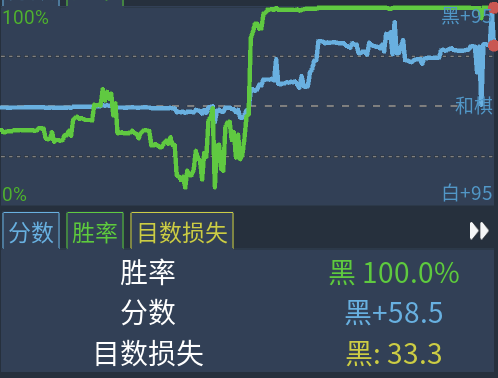

# TinyGo

<div align="center">

[English](README_EN.md) | [简体中文](../README.md) | [日本語](README_JP.md)

</div>

An ultra-lightweight Go AI based on the ResNet neural network, which achieves a high level of play with minimal parameters by learning from KataGo self-play data. This project also provides win-rate prediction and an optional Monte Carlo Tree Search (MCTS) enhancement mode.

TinyGo aims to create a Go AI that runs smoothly on consumer-grade hardware, while also being a perfect project for learning and understanding the construction and training process of ResNet neural networks.

Here are the main features of the project:

- **Lightweight ResNet Architecture**: Uses a custom Deep Residual Network (ResNet) optimized for Go.

- Two model versions:
  *   Standard Model (`/src`): 6 residual blocks, 64 channels.
  *   Large Model (`/src_large`): 10 residual blocks, 128 channels.
  *   Extra Large Model (`/extra_large`): 20 residual blocks, 256 channels. Note that this model has not been trained on a large scale.

*   **Supervised Learning**: Trained using over 30 million high-quality KataGo self-play moves, ensuring the policy network's intuition approaches top-tier AI.
*   **Win Rate Prediction Module (`/win_rate`)**: Independent Value Network, essentially a Mean Squared Error regression task, capable of evaluating the win rate of the current situation (0-100%). Also trained using KataGo self-play data.
*   **MCTS (Monte Carlo Tree Search)**: A complete search algorithm combining the policy network (move suggestions) and value network (position evaluation), significantly improving mid-game fighting and life-and-death calculation capabilities.
*   Built-in Tkinter-based graphical interface, supporting human-machine play, situation judgment display, undo, etc.
*   **Cross-Platform Support**: Runs on Linux, macOS (supports Apple Silicon MPS acceleration), Windows (supports NVIDIA CUDA acceleration).

## Results

Without ultra-large-scale training:

The large model trained for 142 epochs using 4% of the data (1.2 million move samples) achieved a Top1 accuracy of 38.7% and Top5 accuracy of 70.4%.

Large model + MCTSx100 beats KataGo's "Intuition (Level 1)" mode, and has huge room for improvement.



*In the image, Black is TinyGo-large-MCTSx100, and White is KataGo "Intuition (Level 1)" mode.*

Without MCTS, using only the large model for inference, the single-step inference speed on an RTX 5070 Ti GPU reaches an astonishing 0.04 seconds, roughly equivalent to KataGo's "Intuition (Level 1)" mode level.

The small model of `win_rate`, after 18 epochs of training with 4 million samples, achieved an MSE of 0.042 and MAE of 0.112, which is basically usable for MCTS analysis.

### Data Representation

The model input is a tensor of `(Batch_Size, 3, 19, 19)`, containing 3 feature planes:

1.  **Own Stones**: Stone positions of the current player (1 for stone, 0 for empty).
2.  **Opponent Stones**: Stone positions of the opponent.
3.  **Bias Plane**: A matrix of all 1s, used to assist the network in capturing empty space information and boundary features.

### Network Architecture

TinyGo adopts the classic AlphaZero-style ResNet architecture:

*   **Initial Block**: 3x3 convolution kernel, Stride=1, Padding=1, followed by Batch Normalization and ReLU activation.
*   **Residual Tower**: Stacks $N$ residual blocks.
    *   Each residual block contains: `Conv3x3 -> BN -> ReLU -> Conv3x3 -> BN -> Add Skip Connection -> ReLU`.
*   **Policy Head**:
    *   1x1 convolution, output channels: 2.
    *   Batch Normalization + ReLU.
    *   Fully Connected Layer (Linear): Input `2 * 19 * 19`, Output `361` (corresponding to 19x19 board points).
*   **Value Head** (Win rate model only):
    *   1x1 convolution, output channels: 1.
    *   Fully Connected Layer -> ReLU -> Fully Connected Layer -> Sigmoid, outputs a scalar between 0 and 1.

### Training Configuration

*   **Optimizer**: Adam
*   **Learning Rate Scheduler**: `ReduceLROnPlateau` (decays learning rate by 0.5 when validation accuracy plateaus).
*   **Data Augmentation**: To fully utilize data, 8 types of symmetry transformations (Rotation 0/90/180/270 degrees $\times$ Flip or not) are performed in real-time on the GPU during training.
*   **Loss Function**: CrossEntropyLoss (Policy Network), MSE/BCE (Value Network).

### MCTS Algorithm

*   **PUCT Formula**: Used to balance "Exploitation" (choosing high win-rate points) and "Exploration" (visiting less frequently visited points).
    *   $U(s, a) = C_{puct} \times P(s, a) \times \frac{\sqrt{N(s)}}{1 + N(s, a)}$
*   **Simulation Count**: Default 100 times/step (configurable).
*   **Multi-threading**: Supports accelerating search via batch evaluation at the Python level.

## Installation Guide

1. **Clone Project Code**

   ```bash
   git clone https://github.com/LaoChouPro/TinyGo.git
   cd TinyGo
   ```

2. **Install Dependencies**
   Please ensure your Python version is $\ge$ 3.8.

   ```bash
   pip install -r requirements.txt
   ```

   *   **GPU Acceleration Tips**:
       *   **NVIDIA Users**: Please install the CUDA version of PyTorch (e.g., `pip install torch --index-url https://download.pytorch.org/whl/cu118`).
       *   **Mac Users**: PyTorch supports MPS (Metal Performance Shaders) by default, no extra operation needed.

## Using TinyGo for Play and Training

### 1. Play (Human vs. AI)

**Standard Mode (Fast Response)**

Uses only the policy network for moves, extremely fast, suitable for quickly testing layouts and joseki.

Note that this script uses the large model. You can change the model path in the source code.

```bash
python play_gui.py
```

**MCTS Enhanced Mode (Strongest Play)**
Enables Monte Carlo Tree Search, combined with win rate valuation, providing deep calculation capabilities.

```bash
python play_gui_mcts.py
```

### 2. Model Training (Train)

If you want to continue training with existing data (current models are not trained on a massive scale), or wish to reproduce training results, use the following scripts.

**Train Policy Network**

```bash
python src/train.py # Similarly, use python src_large/train.py to train the large model.
```

Set according to interactive prompts:

*   `Epochs`: Number of training epochs. Note: this number should continue from the previous training epoch. For example, if the best model was trained to epoch 30, enter 35 to continue training for 5 epochs.
*   `Batch Size`: Batch size (recommended 64-1024, depending on VRAM).
*   `Learning Rate`: Learning rate (default 0.001, automatically scheduled by optimizer).

**Train Value Network**

```bash
cd win_rate
python process_data.py  # Step 1: Preprocess data
python src_small/train.py  # Step 2: Start training
```

## Project Structure Details

*   `src/`: **Standard Model Source Code**
    *   `model.py`: Defines TinyGoNet (6 blocks) structure.
    *   `train.py`: Main training loop, including data loading and validation logic.
    *   `dataset.py`: Processes SGF data, generates feature tensors.
*   `src_large/`: **Large Model Source Code**
    *   Contains model definition for 10 blocks, 128 channels.
*   `src_extra_large/`: **Extra Large Model Source Code**
    *   Contains model definition for 20 blocks, 256 channels.
*   `src_mcts/`: **Monte Carlo Tree Search Core**
    *   `mcts.py`: MCTS main loop logic.
    *   `node.py`: Tree node definition and PUCT selection formula.
*   `win_rate/`: **Win Rate Prediction Module**
    *   Contains independent data processing and value network training code.
*   `play_gui.py`: Standard mode startup entry.
*   `play_gui_mcts.py`: MCTS mode startup entry.

## Acknowledgements

Training data comes from open-source **KataGo** self-play games, from https://katagoarchive.org.
